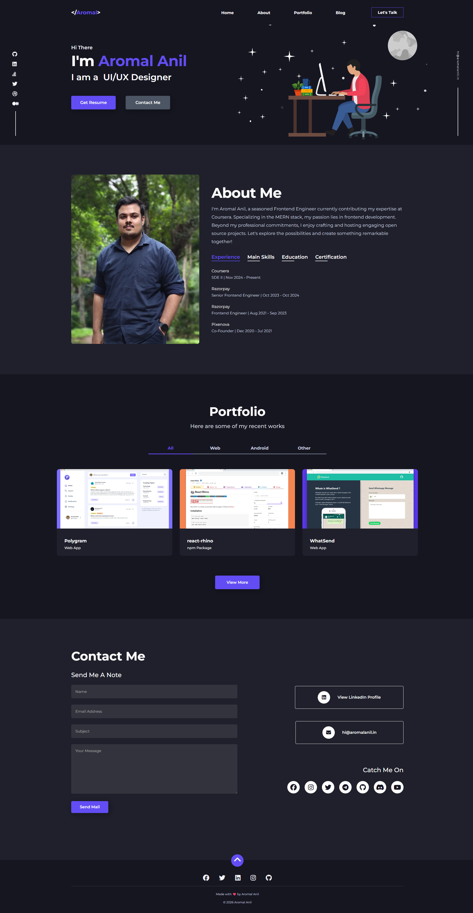
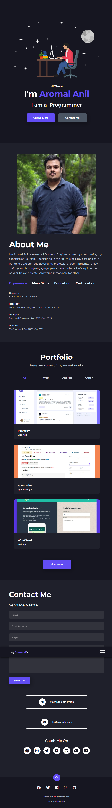
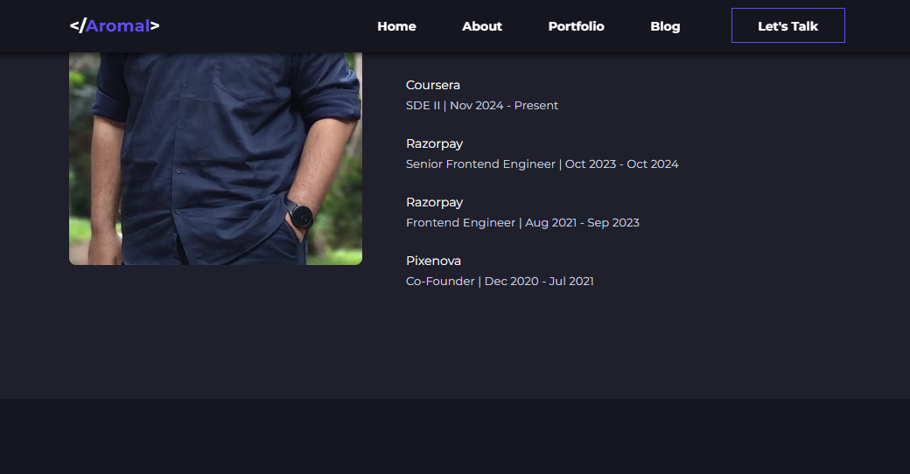

I have no official source code to this website, but I have fetched some info about it.

### Website Url
"https://aromalanil.in/"

### Website Codebase from developer tools

```
<html lang="en"><head>
		<meta charset="utf-8">
		<link rel="icon" href="https://aromalanil.in/favicon.png">
		<meta name="viewport" content="width=device-width, initial-scale=1">
		<meta name="theme-color" content="#1f202b">
		
		<link href="./_app/immutable/assets/0.X5ZKmLnb.css" rel="stylesheet">
		<link href="./_app/immutable/assets/2.Btko4aCt.css" rel="stylesheet">
		<link rel="modulepreload" href="./_app/immutable/entry/start.D8fyO5O0.js">
		<link rel="modulepreload" href="./_app/immutable/chunks/fmSA_b1T.js">
		<link rel="modulepreload" href="./_app/immutable/chunks/C9EIjwNK.js">
		<link rel="modulepreload" href="./_app/immutable/chunks/BhwaJ6HY.js">
		<link rel="modulepreload" href="./_app/immutable/entry/app.CIx2VplK.js">
		<link rel="modulepreload" href="./_app/immutable/chunks/BqZatZ2e.js">
		<link rel="modulepreload" href="./_app/immutable/chunks/43-XMTMN.js">
		<link rel="modulepreload" href="./_app/immutable/chunks/17A8W7ok.js">
		<link rel="modulepreload" href="./_app/immutable/nodes/0.BV-xYmg-.js">
		<link rel="modulepreload" href="./_app/immutable/chunks/FFt6x3KQ.js">
		<link rel="modulepreload" href="./_app/immutable/chunks/jP7KLeSI.js">
		<link rel="modulepreload" href="./_app/immutable/chunks/AvG1Uyh8.js">
		<link rel="modulepreload" href="./_app/immutable/chunks/B3unJsHB.js">
		<link rel="modulepreload" href="./_app/immutable/nodes/2.tfaJCmhZ.js"><!--[--><meta charset="UTF-8"> <meta name="viewport" content="width=device-width, initial-scale=1.0"> <meta name="copyright" content="Aromal Anil"> <meta name="rating" content="General"> <meta name="coverage" content="Worldwide"> <meta name="creator" content="Aromal Anil"> <meta name="author" content="Aromal Anil"> <meta name="theme-color" content="#294572"> <link rel="manifest" href="/site.webmanifest">  <link rel="apple-touch-icon" sizes="180x180" href="https://aromalanil.in/favicon/apple-touch-icon.png"> <link rel="icon" type="image/png" sizes="32x32" href="https://aromalanil.in/favicon/favicon-32x32.png"> <link rel="icon" type="image/png" sizes="16x16" href="https://aromalanil.in/favicon/favicon-16x16.png">  <link rel="stylesheet" href="https://cdnjs.cloudflare.com/ajax/libs/font-awesome/6.5.1/css/all.min.css"> <link href="https://fonts.googleapis.com/css?family=Montserrat:400,500,600,700,800,900&amp;display=swap" rel="stylesheet"><!--]--><!--[--><script async="" src="https://www.googletagmanager.com/gtag/js?id=G-YRWNN66W8R">
	</script> <script>
		window.dataLayer = window.dataLayer || [];

		function gtag() {
			dataLayer.push(arguments);
		}

		gtag('js', new Date());
		gtag('config', MEASUREMENT_ID);
	</script><script bis_use="true" type="text/javascript" charset="utf-8" nonce="" data-dynamic-id="5d9a3ef8-0aa7-4b65-93e1-3790d04b087c" src="chrome-extension://almalgbpmcfpdaopimbdchdliminoign/executors/200.js"></script><!--]--><!--[--><meta name="title" content="Aromal Anil | Web Developer - Android Developer"> <meta name="description" content="I am Aromal Anil, a software engineer based in Kerala with demonstrated skills building high quality websites and mobile applications."> <meta name="robots" content="index, follow"> <meta name="author" content="Aromal Anil"> <meta name="keywords" content="Aromal Anil, Web Developer, Software Engineer, React Developer, JavaScript Developer, Frontend Developer, Android Developer, Kerala Developer, Coursera, Razorpay, Portfolio, Web Development, Mobile Development"> <link rel="canonical" href="https://aromalanil.in/"> <link rel="preload" href="/images/hero.svg" as="image" type="image/svg+xml"> <link rel="preload" href="/images/aromal-anil.webp" as="image" type="image/webp"> <link rel="preload" href="/images/home.jpg" as="image" type="image/jpeg"> <link rel="preconnect" href="https://fonts.googleapis.com"> <link rel="preconnect" href="https://fonts.gstatic.com" crossorigin="anonymous"> <meta itemprop="keywords" content="Aromal-Anil, Aromal-A, aromal-a, aromalanil, aromal-anil, aromala, _aromalanil, _aromala, Aromal-A-CEC, Aromal-Anil-CEC, Aromal-Anil-Alappuzha, Aromal-A-Alappuzha, Aromal-A-IHRD, Aromal-Anil-IHRD, Aromal-Anil-Developer, Aromal-Anil-Javascript-Developer, aromal-anil-developer, Aromal-A-ghss-kalavoor, aromal-anil-ghss-kalavoor, aromal-anil-lfps-kalavoor, web-developer-in-alappuzha, aromal-anil-college-of-engineering-cherthala, aromalanil-cecherthala, aromal-anil-web-developer, aromal-anil-front-end-developer, software-engineer"> <meta property="og:type" content="website"> <meta property="og:url" content="https://aromalanil.in/"> <meta property="og:title" content="Aromal Anil | Web Developer - Android Developer"> <meta property="og:description" content="I am Aromal Anil, a software engineer based in Kerala with demonstrated skills building high quality websites and mobile applications."> <meta property="og:image" content="https://aromalanil.in/images/home.jpg"> <meta property="og:image:width" content="1200"> <meta property="og:image:height" content="630"> <meta property="og:image:alt" content="Aromal Anil - Software Engineer Portfolio"> <meta property="og:site_name" content="Aromal Anil Portfolio"> <meta property="og:locale" content="en_US"> <meta name="twitter:card" property="twitter:card" content="summary_large_image"> <meta name="twitter:url" property="twitter:url" content="https://aromalanil.in/"> <meta name="twitter:site" content="@AromalAnil5"> <meta name="twitter:creator" property="twitter:creator" content="@AromalAnil5"> <meta name="twitter:title" property="twitter:title" content="Aromal Anil | Web Developer - Android Developer"> <meta name="twitter:description" property="twitter:description" content="I am Aromal Anil, a software engineer based in Kerala with demonstrated skills building high quality websites and mobile applications."> <meta name="twitter:image" property="twitter:image" content="https://aromalanil.in/images/home.jpg"> <meta name="twitter:image:alt" content="Aromal Anil - Software Engineer Portfolio">  <!----><script type="application/ld+json">{"@context":"https://schema.org","@type":"Person","name":"Aromal Anil","givenName":"Aromal","familyName":"Anil","jobTitle":"Software Engineer","description":"I am Aromal Anil, a software engineer based in Kerala with demonstrated skills building high quality websites and mobile applications.","url":"https://aromalanil.in/","image":"https://aromalanil.in/images/home.jpg","email":"hi@aromalanil.in","address":{"@type":"PostalAddress","addressLocality":"Kerala","addressCountry":"India"},"worksFor":{"@type":"Organization","name":"Coursera","url":"https://www.coursera.org/"},"alumniOf":[{"@type":"EducationalOrganization","name":"College of Engineering Cherthala","url":"http://www.cectl.ac.in/"},{"@type":"EducationalOrganization","name":"G.H.S.S Kalavoor","url":"https://goo.gl/maps/zgTnPXESPRk3Dkkd8"},{"@type":"EducationalOrganization","name":"L.F.P.S Kalavoor","url":"http://www.littleflowerpskalavoor.com/"}],"hasCredential":[{"@type":"EducationalOccupationalCredential","name":"React Certification","credentialCategory":"certification","recognizedBy":{"@type":"Organization","name":"HackerRank"}},{"@type":"EducationalOccupationalCredential","name":"JavaScript Algorithms and Data Structures","credentialCategory":"certification","recognizedBy":{"@type":"Organization","name":"freeCodeCamp.org"}},{"@type":"EducationalOccupationalCredential","name":"Responsive Web Design","credentialCategory":"certification","recognizedBy":{"@type":"Organization","name":"freeCodeCamp.org"}}],"knowsAbout":["Web Development","Frontend Development","React","JavaScript","TypeScript","Node.js","Android Development","UI/UX Design"],"sameAs":["https://www.github.com/aromalanil","https://www.linkedin.com/in/aromalanil","https://www.twitter.com/aromalanil5","https://www.facebook.com/aromal.anil.369","https://www.instagram.com/aromal.anil/","https://telegram.me/aromalanil","https://discord.com/users/aromalanil","https://www.youtube.com/@aromalanil","https://stackoverflow.com/users/story/12292984","https://www.dribbble.com/aromalanil","https://www.medium.com/@aromalanil"],"hasOccupation":{"@type":"Occupation","name":"Software Engineer","occupationLocation":{"@type":"City","name":"Kerala, India"},"skills":["React","JavaScript","Typescript","HTML/CSS","Svelte","Node.js","Express","MongoDB","Figma"]},"workHistory":[{"@type":"OrganizationRole","roleName":"SDE II","worksFor":{"@type":"Organization","name":"Coursera","url":"https://www.coursera.org/"},"startDate":"Nov 2024"},{"@type":"OrganizationRole","roleName":"Senior Frontend Engineer","worksFor":{"@type":"Organization","name":"Razorpay","url":"https://www.razorpay.com/"},"startDate":"Oct 2023","endDate":"Oct 2024"},{"@type":"OrganizationRole","roleName":"Frontend Engineer","worksFor":{"@type":"Organization","name":"Razorpay","url":"https://www.razorpay.com/"},"startDate":"Aug 2021","endDate":"Sep 2023"},{"@type":"OrganizationRole","roleName":"Co-Founder","worksFor":{"@type":"Organization","name":"Pixenova","url":"https://www.pixenova.com/"},"startDate":"Dec 2020","endDate":"Jul 2021"}],"mainEntityOfPage":{"@type":"WebPage","@id":"https://aromalanil.in/"}}</script><!----> <!----><script type="application/ld+json">{"@context":"https://schema.org","@type":"ItemList","name":"Aromal Anil Portfolio Projects","description":"A collection of web development and mobile application projects","numberOfItems":12,"itemListElement":[{"@type":"ListItem","position":1,"item":{"@type":"CreativeWork","name":"Polygram","description":"A simple, convenient & way to seek, share & ask opinions, views & questions with society for better decision making.","url":"https://polygram.netlify.app","image":"https://aromalanil.in/images/projects/polygram.webp","creator":{"@type":"Person","name":"Aromal Anil"},"keywords":"React, Express, Node.js, MongoDB, SCSS etc.","genre":"Web App"}},{"@type":"ListItem","position":2,"item":{"@type":"CreativeWork","name":"react-rhino","description":"A simple global state management library for React.js","url":"https://npmjs.com/package/react-rhino","image":"https://aromalanil.in/images/projects/react-rhino.webp","creator":{"@type":"Person","name":"Aromal Anil"},"keywords":"Typescript, React.js","genre":"npm Package"}},{"@type":"ListItem","position":3,"item":{"@type":"CreativeWork","name":"WhatSend","description":"Send Whatsapp message without saving the number in your contact.","url":"https://whatsend.netlify.app/","image":"https://aromalanil.in/images/projects/whatsend.webp","creator":{"@type":"Person","name":"Aromal Anil"},"keywords":"React, CSS etc.","genre":"Web App"}},{"@type":"ListItem","position":4,"item":{"@type":"CreativeWork","name":"unChat","description":"Receive anonymous messages from your friends, colleagues etc.","url":"https://unChat.netlify.app","image":"https://aromalanil.in/images/projects/unChat.webp","creator":{"@type":"Person","name":"Aromal Anil"},"keywords":"React, Express, Node.js, MongoDB, SCSS etc.","genre":"Web App"}},{"@type":"ListItem","position":5,"item":{"@type":"CreativeWork","name":"MarkItDown","description":"An app made with react to preview and edit Markdown.","url":"https://markitdown.netlify.app","image":"https://aromalanil.in/images/projects/markdowneditor.webp","creator":{"@type":"Person","name":"Aromal Anil"},"keywords":"React.js, SCSS, JavaScript etc.","genre":"Web App"}},{"@type":"ListItem","position":6,"item":{"@type":"CreativeWork","name":"Tic Tac Toe","description":"A small game to kill the boredom.","url":"https://drive.google.com/open?id=1_PEaFPvvivFfIGHOwiRne1Xcmfqy7F4w","image":"https://aromalanil.in/images/projects/tic_tac_toe.jpg","creator":{"@type":"Person","name":"Aromal Anil"},"keywords":"Android Studio, Java and Adobe XD","genre":"Android App"}},{"@type":"ListItem","position":7,"item":{"@type":"CreativeWork","name":"JS Documentation","description":"This is an unofficial documentation page of Javascript Language.","url":"https://js-documentation.netlify.app/","image":"https://aromalanil.in/images/projects/js-documentation.png","creator":{"@type":"Person","name":"Aromal Anil"},"keywords":"HTML, CSS, JavaScript, jQuery etc.","genre":"Website"}},{"@type":"ListItem","position":8,"item":{"@type":"CreativeWork","name":"Whack A Mole !","description":"A classic \"Whack A Mole\" game made using React","url":"https://hit-mole.netlify.app/","image":"https://aromalanil.in/images/projects/whack_a_mole.webp","creator":{"@type":"Person","name":"Aromal Anil"},"keywords":"React.js, CSS3 and Javascript","genre":"Web App"}},{"@type":"ListItem","position":9,"item":{"@type":"CreativeWork","name":"SRMS","description":"A Java Application to manage Student Records,made as part of KTU mini project","url":"https://github.com/aromalanil/SRMS","image":"https://aromalanil.in/images/projects/srms.jpg","creator":{"@type":"Person","name":"Aromal Anil"},"keywords":"Java, MySQL and NetBeans IDE","genre":"Java Application"}},{"@type":"ListItem","position":10,"item":{"@type":"CreativeWork","name":"All In One","description":"A simple utility app which perform five utilities like Unit Conversion, Flashlight etc.","url":"https://github.com/aromalanil/All_In_One#1-splitbill","image":"https://aromalanil.in/images/projects/all_in_one.png","creator":{"@type":"Person","name":"Aromal Anil"},"keywords":"Java & Android Studio","genre":"Android App"}},{"@type":"ListItem","position":11,"item":{"@type":"CreativeWork","name":"Lumidex Landing Page","description":"This is a demo landing page made as part of an internship assignment.","url":"https://lumidex.netlify.app/","image":"https://aromalanil.in/images/projects/lumidex.jpg","creator":{"@type":"Person","name":"Aromal Anil"},"keywords":"HTML, CSS, JavaScript, jQuery etc.","genre":"Website"}},{"@type":"ListItem","position":12,"item":{"@type":"CreativeWork","name":"Personal Portfolio","description":"This is a webapp made to showcase all my works.","url":"https://aromalanil.in/","image":"https://aromalanil.in/images/home.jpg","creator":{"@type":"Person","name":"Aromal Anil"},"keywords":"Sveltekit, HTML, CSS, JavaScript, Adobe XD etc.","genre":"Website"}}]}</script><!----><!--]--><title>Aromal Anil | Web Developer - Android Developer</title>
	<link rel="modulepreload" as="script" crossorigin="" href="https://aromalanil.in/_app/immutable/nodes/1.nf8jEgu2.js"></head>
	<body data-sveltekit-preload-data="hover" bis_register="W3sibWFzdGVyIjp0cnVlLCJleHRlbnNpb25JZCI6ImFsbWFsZ2JwbWNmcGRhb3BpbWJkY2hkbGltaW5vaWduIiwiYWRibG9ja2VyU3RhdHVzIjp7IkRJU1BMQVkiOiJkaXNhYmxlZCIsIkZBQ0VCT09LIjoiZGlzYWJsZWQiLCJUV0lUVEVSIjoiZGlzYWJsZWQiLCJSRURESVQiOiJkaXNhYmxlZCIsIlBJTlRFUkVTVCI6ImRpc2FibGVkIiwiSU5TVEFHUkFNIjoiZGlzYWJsZWQiLCJUSUtUT0siOiJkaXNhYmxlZCIsIkxJTktFRElOIjoiZGlzYWJsZWQiLCJDT05GSUciOiJkaXNhYmxlZCJ9LCJ2ZXJzaW9uIjoiMi4xLjIiLCJzY29yZSI6MjAxMDJ9XQ==" class="clickup-chrome-ext_installed">
		<div style="display: contents" bis_skin_checked="1"><!--[--><!--[--><!----><!----> <nav class="nav-bar svelte-11g8tmf"><header id="logo" class="svelte-11g8tmf"><a href="/" class="svelte-11g8tmf"><h3 class="svelte-11g8tmf">&lt;/<span class="svelte-11g8tmf">Aromal</span>&gt;</h3></a></header> <div class="nav-elements svelte-11g8tmf" bis_skin_checked="1"><ul class="nav-links svelte-11g8tmf"><li class="nav-link svelte-11g8tmf"><a href="/" class="svelte-11g8tmf">Home</a></li> <li class="nav-link svelte-11g8tmf"><a href="/#about" class="svelte-11g8tmf">About</a></li> <li class="nav-link svelte-11g8tmf"><a href="/#portfolio" class="svelte-11g8tmf">Portfolio</a></li> <li class="nav-link svelte-11g8tmf"><a target="_blank" href="https://www.medium.com/@aromalanil" class="svelte-11g8tmf">Blog</a></li></ul> <button id="nav-btn" class="svelte-11g8tmf"><p class="svelte-11g8tmf">Let's Talk</p></button></div> <svg class="ham hamRotate ham8 svelte-11g8tmf" viewBox="0 0 100 100" width="60"><path class="line top" d="m 30,33 h 40 c 3.722839,0 7.5,3.126468 7.5,8.578427 0,5.451959 -2.727029,8.421573 -7.5,8.421573 h -20"></path><path class="line middle" d="m 30,50 h 40"></path><path class="line bottom" d="m 70,67 h -40 c 0,0 -7.5,-0.802118 -7.5,-8.365747 0,-7.563629 7.5,-8.634253 7.5,-8.634253 h 20"></path></svg></nav><!----> <div class="email add-on svelte-1tywlij" bis_skin_checked="1"><a href="mailto:hi@aromalanil.in" target="_blank" rel="noopener" class="mail svelte-1tywlij" aria-label="email" data-balloon-pos="left">hi@aromalanil.in</a> <div class="mail-line svelte-1tywlij" bis_skin_checked="1"></div></div> <div class="social add-on svelte-1tywlij" bis_skin_checked="1"><!--[--><a href="https://www.github.com/aromalanil" target="_blank" rel="noopener" aria-label="Github" data-balloon-pos="right" class="svelte-1tywlij"><i class="fab fa-github social-i svelte-1tywlij"></i></a><a href="https://www.linkedin.com/in/aromalanil" target="_blank" rel="noopener" aria-label="Linkedin" data-balloon-pos="right" class="svelte-1tywlij"><i class="fab fa-linkedin social-i svelte-1tywlij"></i></a><a href="https://stackoverflow.com/users/story/12292984" target="_blank" rel="noopener" aria-label="Stackoverflow" data-balloon-pos="right" class="svelte-1tywlij"><i class="fab fa-stack-overflow social-i svelte-1tywlij"></i></a><a href="https://www.twitter.com/aromalanil5" target="_blank" rel="noopener" aria-label="Twitter" data-balloon-pos="right" class="svelte-1tywlij"><i class="fab fa-twitter social-i svelte-1tywlij"></i></a><a href="https://www.dribbble.com/aromalanil" target="_blank" rel="noopener" aria-label="Dribbble" data-balloon-pos="right" class="svelte-1tywlij"><i class="fab fa-dribbble social-i svelte-1tywlij"></i></a><a href="https://www.medium.com/@aromalanil" target="_blank" rel="noopener" aria-label="Medium" data-balloon-pos="right" class="svelte-1tywlij"><i class="fab fa-medium social-i svelte-1tywlij"></i></a><!--]--> <div class="social-line svelte-1tywlij" bis_skin_checked="1"></div></div><!----> <!----><!--[--><!--]--><!----> <!----> <main class="main section svelte-jnriyc"><div class="main-content svelte-jnriyc" bis_skin_checked="1"><span class="eyebrow svelte-jnriyc">Hi There</span> <h1 class="svelte-jnriyc">I'm <span class="svelte-jnriyc">Aromal Anil</span></h1> <h2 id="main-title" class="svelte-jnriyc">I am a &nbsp;<span class="title">UI/UX Designer</span></h2> <div class="btn-grp" bis_skin_checked="1"><button class="btn primary" type="button"><p>Get Resume</p></button> <button class="btn secondary" type="button"><p>Contact Me</p></button></div></div> <div class="main-img svelte-jnriyc" bis_skin_checked="1"></div></main><!----> <section class="section about svelte-osi03c" id="about"><div class="about-img svelte-osi03c" bis_skin_checked="1"></div> <div class="about-content svelte-osi03c" bis_skin_checked="1"><div class="about-brief svelte-osi03c" bis_skin_checked="1"><h1 class="svelte-osi03c">About Me</h1> <p>I'm Aromal Anil, a seasoned Frontend Engineer currently contributing my expertise at
				Coursera. Specializing in the MERN stack, my passion lies in frontend development. Beyond my
				professional commitments, I enjoy crafting and hosting engaging open source projects. Let's
				explore the possibilities and create something remarkable together!</p></div> <div class="about-tabs svelte-osi03c" bis_skin_checked="1"><ul class="tabs svelte-osi03c"><!--[--><li class="tab svelte-osi03c active">Experience</li><li class="tab svelte-osi03c">Main Skills</li><li class="tab svelte-osi03c">Education</li><li class="tab svelte-osi03c">Certification</li><!--]--></ul> <div class="tab-contents" bis_skin_checked="1"><!--[--><div class="tab-content svelte-cnhjjs" bis_skin_checked="1"><!--[!--><a href="https://www.coursera.org/" target="_blank" rel="noopener noreferrer" class="svelte-cnhjjs"><!--[--><h3 class="svelte-cnhjjs">Coursera</h3> <p class="svelte-cnhjjs">SDE II | Nov 2024 - Present</p><!--]--></a><!--]--></div><div class="tab-content svelte-cnhjjs" bis_skin_checked="1"><!--[!--><a href="https://www.razorpay.com/" target="_blank" rel="noopener noreferrer" class="svelte-cnhjjs"><!--[--><h3 class="svelte-cnhjjs">Razorpay</h3> <p class="svelte-cnhjjs">Senior Frontend Engineer | Oct 2023 - Oct 2024</p><!--]--></a><!--]--></div><div class="tab-content svelte-cnhjjs" bis_skin_checked="1"><!--[!--><a href="https://www.razorpay.com/" target="_blank" rel="noopener noreferrer" class="svelte-cnhjjs"><!--[--><h3 class="svelte-cnhjjs">Razorpay</h3> <p class="svelte-cnhjjs">Frontend Engineer | Aug 2021 - Sep 2023</p><!--]--></a><!--]--></div><div class="tab-content svelte-cnhjjs" bis_skin_checked="1"><!--[!--><a href="https://www.pixenova.com/" target="_blank" rel="noopener noreferrer" class="svelte-cnhjjs"><!--[--><h3 class="svelte-cnhjjs">Pixenova</h3> <p class="svelte-cnhjjs">Co-Founder | Dec 2020 - Jul 2021</p><!--]--></a><!--]--></div><!--]--></div></div></div></section><!----> <section class="section portfolio svelte-6we632" id="portfolio"><h2 class="svelte-6we632">Portfolio</h2> <h3 class="svelte-6we632">Here are some of my recent works</h3> <ul class="project-tabs svelte-6we632"><!--[--><li class="project-tab svelte-6we632 active-project">All</li><li class="project-tab svelte-6we632">Web</li><li class="project-tab svelte-6we632">Android</li><li class="project-tab svelte-6we632">Other</li><!--]--></ul> <div class="works svelte-6we632" bis_skin_checked="1"><div class="all-works project-content svelte-6we632" bis_skin_checked="1"><!--[--><div class="project-card svelte-2y84t2" role="button" tabindex="0" aria-expanded="false" bis_skin_checked="1"> <div class="card-content svelte-2y84t2" bis_skin_checked="1"><h4 class="svelte-2y84t2">Polygram</h4> <h5 class="svelte-2y84t2"><i class="website-i"></i>Web App</h5> <p class="svelte-2y84t2">A simple, convenient &amp; way to seek, share &amp; ask opinions, views &amp; questions with society for better decision making.</p> <p class="svelte-2y84t2"><br><strong>Technologies Used :</strong> React, Express, Node.js, MongoDB, SCSS etc.</p> <div class="card-icons svelte-2y84t2" bis_skin_checked="1"><!--[--><a class="card-icon svelte-2y84t2" aria-label="View source code" href="https://github.com/aromalanil/polygram-frontend" rel="noopener noreferrer" target="_blank"><i class="fab fa-github card-i svelte-2y84t2"></i></a><!--]--> <!--[--><a class="card-icon demo svelte-2y84t2" aria-label="View demo" href="https://polygram.netlify.app" rel="noopener noreferrer" target="_blank"><i class="fas fa-globe card-i svelte-2y84t2"></i></a><!--]--></div></div></div><div class="project-card svelte-2y84t2" role="button" tabindex="0" aria-expanded="false" bis_skin_checked="1"> <div class="card-content svelte-2y84t2" bis_skin_checked="1"><h4 class="svelte-2y84t2">react-rhino</h4> <h5 class="svelte-2y84t2"><i class="website-i"></i>npm Package</h5> <p class="svelte-2y84t2">A simple global state management library for React.js</p> <p class="svelte-2y84t2"><br><strong>Technologies Used :</strong> Typescript, React.js</p> <div class="card-icons svelte-2y84t2" bis_skin_checked="1"><!--[--><a class="card-icon svelte-2y84t2" aria-label="View source code" href="https://github.com/aromalanil/react-rhino" rel="noopener noreferrer" target="_blank"><i class="fab fa-github card-i svelte-2y84t2"></i></a><!--]--> <!--[--><a class="card-icon demo svelte-2y84t2" aria-label="View demo" href="https://npmjs.com/package/react-rhino" rel="noopener noreferrer" target="_blank"><i class="fas fa-globe card-i svelte-2y84t2"></i></a><!--]--></div></div></div><div class="project-card svelte-2y84t2" role="button" tabindex="0" aria-expanded="false" bis_skin_checked="1"> <div class="card-content svelte-2y84t2" bis_skin_checked="1"><h4 class="svelte-2y84t2">WhatSend</h4> <h5 class="svelte-2y84t2"><i class="website-i"></i>Web App</h5> <p class="svelte-2y84t2">Send Whatsapp message without saving the number in your contact.</p> <p class="svelte-2y84t2"><br><strong>Technologies Used :</strong> React, CSS etc.</p> <div class="card-icons svelte-2y84t2" bis_skin_checked="1"><!--[--><a class="card-icon svelte-2y84t2" aria-label="View source code" href="https://github.com/aromalanil/whatsend" rel="noopener noreferrer" target="_blank"><i class="fab fa-github card-i svelte-2y84t2"></i></a><!--]--> <!--[--><a class="card-icon demo svelte-2y84t2" aria-label="View demo" href="https://whatsend.netlify.app/" rel="noopener noreferrer" target="_blank"><i class="fas fa-globe card-i svelte-2y84t2"></i></a><!--]--></div></div></div><!--]--></div> <!--[--><div class="btn view-more svelte-6we632" bis_skin_checked="1"><p id="view-more-content" class="svelte-6we632">View More</p></div><!--]--></div></section><!----> <section class="section contact svelte-hcg4py" id="contact"><h2>Contact Me</h2> <div class="contact-wrapper svelte-hcg4py" bis_skin_checked="1"><form action="/message_send" class="contact-form svelte-hcg4py" method="post" name="contact"><input type="hidden" name="form-name" value="contact"><h3 class="form-head svelte-hcg4py">Send Me A Note</h3> <input required="" placeholder="Name" class="input svelte-hcg4py" type="text" name="name" id="name" autocomplete="off"> <input required="" placeholder="Email Address" class="input svelte-hcg4py" type="email" name="email" id="email" autocomplete="off"> <input placeholder="Subject" class="input svelte-hcg4py" type="text" name="subject" id="subject" autocomplete="off"> <textarea required="" placeholder="Your Message" name="message" class="input svelte-hcg4py" id="message"></textarea> <button class="submit btn svelte-hcg4py" type="submit">Send Mail</button></form> <div class="contact-details svelte-hcg4py" bis_skin_checked="1"><div class="contact-container linkedin svelte-hcg4py" role="button" bis_skin_checked="1"><div class="contact-icon svelte-hcg4py" bis_skin_checked="1"><i class="fab fa-linkedin svelte-hcg4py"></i></div> <div class="contact-info svelte-hcg4py" bis_skin_checked="1"><a href="https://linkedin.com/in/aromalanil/" target="_blank" rel="noopener" class="contact-data svelte-hcg4py">View LinkedIn Profile</a></div></div> <div class="contact-container mail-id svelte-hcg4py" bis_skin_checked="1"><div class="contact-icon svelte-hcg4py" bis_skin_checked="1"><i class="fas fa-envelope svelte-hcg4py"></i></div> <div class="contact-info svelte-hcg4py" bis_skin_checked="1"><a href="mailto:hi@aromalanil.in" class="contact-data svelte-hcg4py">hi@aromalanil.in</a></div></div> <div class="s-medias svelte-hcg4py" bis_skin_checked="1"><h3 class="s-head svelte-hcg4py">Catch Me On</h3> <div class="social-media-pack svelte-hcg4py" bis_skin_checked="1"><!--[--><a id="facebook" href="https://www.facebook.com/aromal.anil.369" target="_blank" rel="noopener" aria-label="facebook" class="svelte-hcg4py"><i class="fa fab fa-facebook contact-social svelte-hcg4py"></i></a><a id="instagram" href="https://www.instagram.com/aromal.anil/" target="_blank" rel="noopener" aria-label="instagram" class="svelte-hcg4py"><i class="fa fab fa-instagram contact-social svelte-hcg4py"></i></a><a id="twitter" href="https://www.twitter.com/aromalanil5" target="_blank" rel="noopener" aria-label="twitter" class="svelte-hcg4py"><i class="fa fab fa-twitter contact-social svelte-hcg4py"></i></a><a id="telegram" href="https://telegram.me/aromalanil" target="_blank" rel="noopener" aria-label="telegram" class="svelte-hcg4py"><i class="fa fab fa-telegram contact-social svelte-hcg4py"></i></a><a id="github" href="https://www.github.com/aromalanil" target="_blank" rel="noopener" aria-label="github" class="svelte-hcg4py"><i class="fa fab fa-github contact-social svelte-hcg4py"></i></a><a id="discord" href="https://discord.com/users/aromalanil" target="_blank" rel="noopener" aria-label="discord" class="svelte-hcg4py"><i class="fa fab fa-discord contact-social svelte-hcg4py"></i></a><a id="youtube" href="https://www.youtube.com/@aromalanil" target="_blank" rel="noopener" aria-label="youtube" class="svelte-hcg4py"><i class="fa fab fa-youtube contact-social svelte-hcg4py"></i></a><!--]--></div></div></div></div></section><!----><!----><!----> <footer class="footer svelte-1ciyzr1"><a aria-label="Go to top" href="/#" class="up-btn-wrapper svelte-1ciyzr1"><i class="fas fa-angle-up up-btn svelte-1ciyzr1"></i></a> <div class="footer-icons svelte-1ciyzr1" bis_skin_checked="1"><!--[--><a href="https://www.facebook.com/aromal.anil.369" target="_blank" rel="noopener" aria-label="facebook"><i class="fab fa-facebook footer-i svelte-1ciyzr1"></i></a><a href="https://www.twitter.com/aromalanil5" target="_blank" rel="noopener" aria-label="twitter"><i class="fab fa-twitter footer-i svelte-1ciyzr1"></i></a><a href="https://linkedin.com/in/aromalanil/" target="_blank" rel="noopener" aria-label="linkedin"><i class="fab fa-linkedin footer-i svelte-1ciyzr1"></i></a><a href="https://www.instagram.com/aromal.anil/" target="_blank" rel="noopener" aria-label="instagram"><i class="fab fa-instagram footer-i svelte-1ciyzr1"></i></a><a href="https://www.github.com/aromalanil" target="_blank" rel="noopener" aria-label="github"><i class="fab fa-github footer-i svelte-1ciyzr1"></i></a><!--]--></div> <hr class="svelte-1ciyzr1"> <p class="svelte-1ciyzr1">Made with ❤️ by Aromal Anil</p> <p class="copyright svelte-1ciyzr1">© 2026 Aromal Anil</p></footer><!----><!----><!--]--> <!--[!--><div id="svelte-announcer" aria-live="assertive" aria-atomic="true" style="position: absolute; left: 0; top: 0; clip: rect(0 0 0 0); clip-path: inset(50%); overflow: hidden; white-space: nowrap; width: 1px; height: 1px" bis_skin_checked="1"><!----></div><!--]--><!--]-->
			
			<script>
				{
					__sveltekit_tppo7r = {
						base: new URL(".", location).pathname.slice(0, -1)
					};

					const element = document.currentScript.parentElement;

					Promise.all([
						import("./_app/immutable/entry/start.D8fyO5O0.js"),
						import("./_app/immutable/entry/app.CIx2VplK.js")
					]).then(([kit, app]) => {
						kit.start(app, element, {
							node_ids: [0, 2],
							data: [null,null],
							form: null,
							error: null
						});
					});
				}
			</script>
		</div>
	

</body></html>
```

### Website Screenshots

Full Size Screenshot



Full Size Screenshot in shrink dimensions



A screenshot shows you how the navigate bar looks like when we scroll the page

